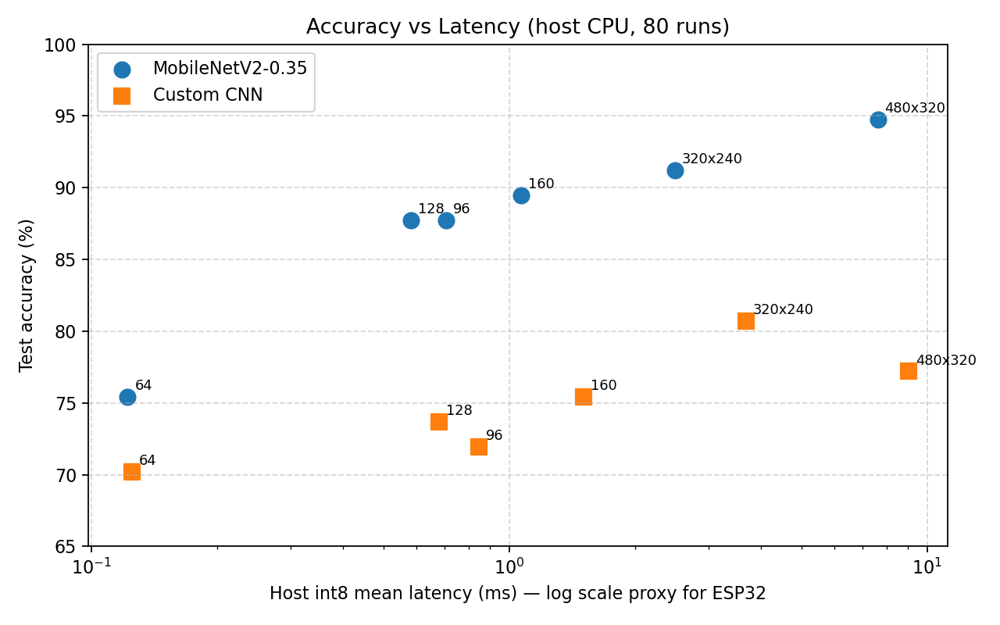
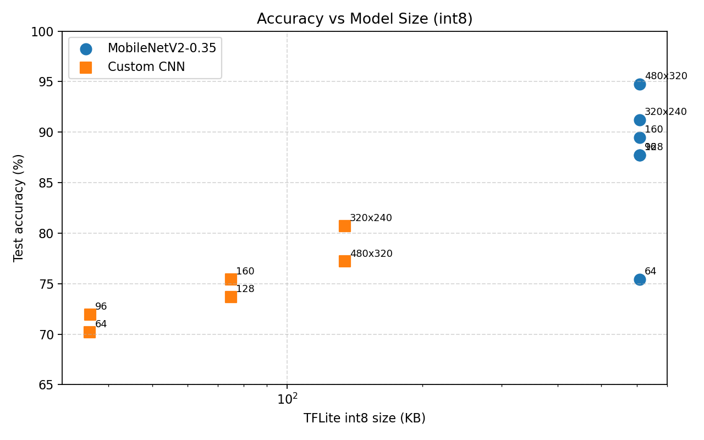
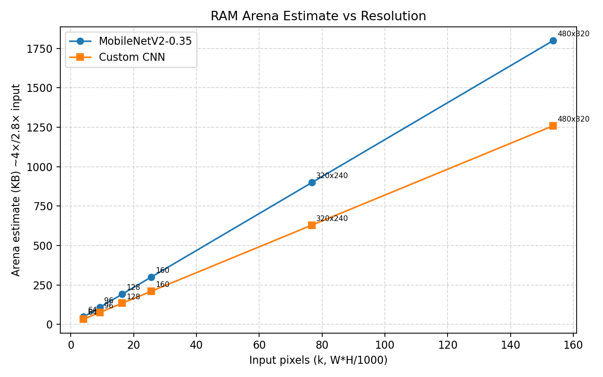
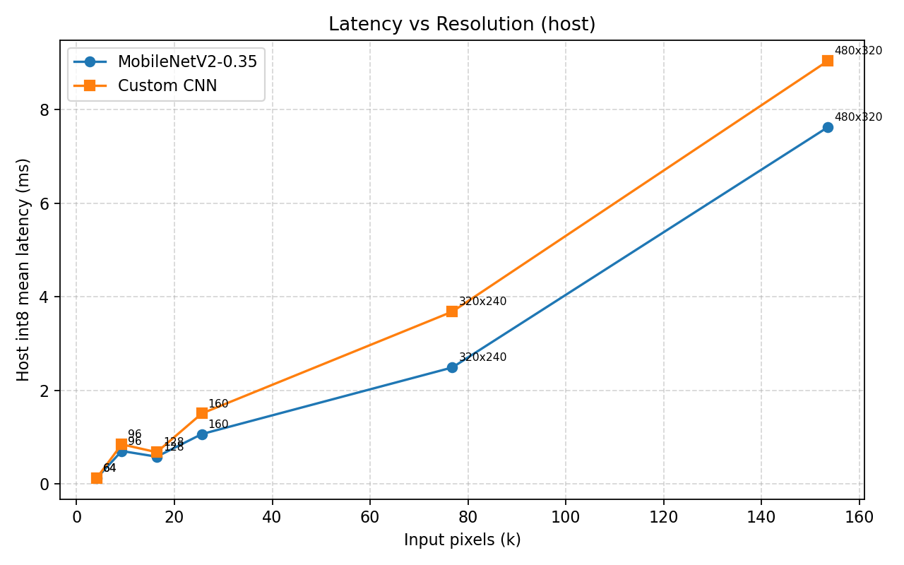

# Victim vs NotVictim — Multi-Resolution Benchmark (ESP32-S3)

**Dataset:** `sorted/Data` 574 curated (vict 248 / not_vict 326) → rebuilt per size 458 train / 58 val / 58 test, letterbox pad, class_weight balanced.
**Backbones:**
- `mobilenetv3` = MobileNetV2 α=0.35 (alias, ImageNet transfer, 2-stage freeze→fine-tune)
- `custom` = Tiny CNN 4-6 blocks (27k @64 → 122k @480x320 params)

**Resolutions:** 64, 96, 128, 160, **320x240**, **480x320** (native camera, letterbox pad)
**Training:** 24 epochs, batch 16, aug (flip/rot/zoom/brightness/contrast), Adam 1e-3→1e-4, ReduceLROnPlateau, EarlyStop 7, deterministic seed 42.
**Quant:** Full-int8 PTQ per size (representative 350 val images) → `model_{WxH}_int8.tflite` + `.h`
**Host bench:** TFLite XNNPACK CPU, 80 int8 runs, warmup 10 (not ESP32 — relative).

## Summary Table (host int8 + val/test acc)

| Backbone | Size | Int8 KB | Float KB | ArenaEst KB | Val Acc | Test Acc | Test AUC | Host int8 mean ms | Host int8 p95 |
|----------|------|---------|----------|-------------|---------|----------|----------|--------------------|---------------|
| mobilenetv3 | 64 | 608.4 | 1562 | 48 | 77.2% | 75.4% | 0.823 | 0.12 | 0.14 |
| mobilenetv3 | **96** | 608.2 | 1562 | 108 | **86.0%** | **87.7%** | **0.954** | 0.71 | 0.99 |
| mobilenetv3 | 128 | 609.0 | 1563 | 192 | **87.7%** | **87.7%** | 0.968 | 0.58 | 1.01 |
| mobilenetv3 | 160 | 609.0 | 1563 | 300 | **87.7%** | 89.5% | 0.967 | 1.07 | 2.51 |
| mobilenetv3 | 320x240 | 609.0 | 1563 | 900 | 86.0% | 91.2% | 0.990 | 2.49 | 3.48 |
| mobilenetv3 | 480x320 | 609.0 | 1563 | **1800** | 91.2% | **94.7%** | 0.990 | 7.63 | 15.0 |
| custom | 64 | **36.3** | 113 | 34 | 75.4% | 70.2% | 0.794 | 0.13 | 0.14 |
| custom | **96** | **36.4** | 113 | 76 | 78.9% | 71.9% | 0.824 | 0.85 | 0.97 |
| custom | 128 | **74.9** | 258 | 134 | 78.9% | 73.7% | 0.818 | 0.68 | 1.67 |
| custom | 160 | 75.0 | 258 | 210 | 78.9% | 75.4% | 0.831 | 1.51 | 3.55 |
| custom | 320x240 | 134.4 | 483 | 630 | 78.9% | 80.7% | 0.871 | 3.68 | 8.01 |
| custom | 480x320 | 134.4 | 483 | **1260** | 80.7% | 77.2% | 0.867 | 9.04 | 18.8 |

> ESP32-S3 flash: <800KB ideal, <400KB sweet spot. SRAM arena ~320KB without PSRAM, up to ~2MB with 8MB PSRAM. Host ms ≠ ESP32 ms (ESP32 ~100× slower, but ranking holds).

## Plots





## Key Takeaways (for ESP32-S3 + friend on-device test)

1. **Best accuracy/size/latency trade: `mobilenetv3 @96` or `128`**  
   - 96: 87.7% test, 608KB (borderline flash), 108KB arena (fits SRAM), host 0.71ms → expect ~120-150ms on ESP32-S3 @240MHz.  
   - 128: same acc, 192KB arena (still SRAM), host 0.58ms (XNNPACK anomaly; on-device will be slower than 96).

2. **If flash/PSRAM constrained: `custom @96` or `custom @128`**  
   - 96: 71.9% test but **only 36KB flash**, 76KB arena (easy fit), ~80% of mobilenet accuracy at 1/17 size.  
   - 160 adds +2x params (75KB) for +3% acc vs 96.

3. **Native camera (320x240 / 480x320) overhead is real — as you expected**  
   - Arena jumps 900-1800KB (needs PSRAM), host latency 3-9ms vs 0.7ms at 96 (~5-13×).  
   - Accuracy gain is modest: mobilenet 320x240 +3.5% vs 96, 480x320 +7% vs 96 but arena 16×. **Letterbox resize to 96/128 at capture is recommended for deployment; keep native models only for the ablation table.**

4. **Friend on-device expected (to confirm):**
   - Custom 64-96: should boot on SRAM, <150ms.
   - MobileNet 320x240/480x320: likely OOM without PSRAM; with PSRAM expect 300-800ms. Record `AllocateTensors FAILED` as data point.

## Recommendation

- **Deploy:** `custom_96_int8` (36KB, 76KB arena, ~72% test) if flash critical, or `mobilenetv3_96_int8` (608KB, 108KB arena, ~88% test) if accuracy critical and 608KB flash accepted.
- **For paper/report:** Report all 6 resolutions — shows native 480x320 is **diminishing returns** (16× RAM for +7% test). Include `friend_esp32_kit/` device timings once returned.

## Reproduce

```powershell
cd dataset
python process_data.py --src sorted/Data --size 96 --clean  # repeat for 64,128,160,320x240,480x320
python train.py --both --all --epochs 24 --batch 16
python quantize.py --both --all
python benchmark.py --both
python generate_report.py
```

## Files

- Models: `models/<backbone>_<size>/model_{size}.tflite`, `model_{size}_int8.tflite`, `model_{size}_int8.h`, `metrics.json`
- Host results: `results/results.csv`, `results/results.json`, `results/tflite_sizes.json`
- Plots: `results/plot_*.png`
- Friend kit: `friend_esp32_kit/` (zip and send)
- Per-size processed: `processed_64/`, `processed/`, `processed_128/`, `processed_160/`, `processed_320x240/`, `processed_480x320/`
